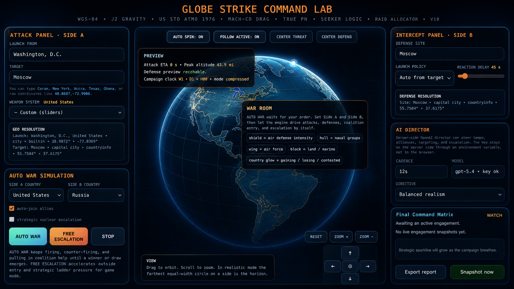

# Globe Strike Command Lab

A browser-based **fictional global conflict simulation sandbox** that combines geospatial visualization, campaign-state logic, AI-directed decision policy, numerical stockpiles, uncertainty modeling, and engagement statistics in one local application.

The project is designed as a game / simulation environment. Its country, doctrine, inventory, reliability, readiness, and engagement values are synthetic or game-normalized unless explicitly marked otherwise.

## Application interface



The browser interface brings the attack panel, defensive-intercept controls, interactive globe, automated campaign simulation, AI director, and command-status reporting into one operational-style simulation workspace.

## Highlights

- Interactive 3D-style globe / geospatial conflict visualization
- Attack and defensive-intercept simulation
- Campaign state for offense, defense, logistics, C2, readiness and sensor confidence
- Synthetic numerical stockpiles and reserve pressure
- AI campaign director with a built-in fallback mode
- Rolling engagement memory and calibration statistics
- Confidence intervals for selected engagement outcomes
- Location search / geocoding support
- Local-first architecture with no mandatory cloud dependency

## AI director

The AI director operates above the numerical simulation rather than replacing it. It receives a bounded snapshot of campaign state and returns policy values that influence the running game, including tempo, reserve commitment, repair priority, sensor focus, defense posture, uncertainty tolerance, and related synthetic simulation controls.

If `OPENAI_API_KEY` is configured, the app can use its external AI director integration. If no key is supplied, the simulation continues with its built-in deterministic fallback director.

## Quick start

### 1. Clone

```bash
git clone <your-repository-url>
cd globe-strike-command-lab
```

### 2. Create a virtual environment

```bash
python3 -m venv .venv
source .venv/bin/activate
```

On Windows:

```powershell
.venv\Scripts\activate
```

### 3. Install optional location-data dependencies

```bash
python -m pip install -r requirements.txt
```

The app can still run with built-in fallback location data if these packages are unavailable.

### 4. Optional AI configuration

Copy the environment template:

```bash
cp .env.example .env
```

Then set:

```text
OPENAI_API_KEY=your_key_here
```

Do **not** commit `.env` or API keys to GitHub.

### 5. Run

```bash
python app.py
```

The application starts a local web server and opens the browser automatically. By default it uses:

```text
http://localhost:8080
```

If port 8080 is occupied, the app automatically selects the next available
port through 8095 and prints the selected address in the terminal.

## Repository structure

```text
.
├── app.py                         # Application, backend and embedded browser UI
├── requirements.txt               # Optional location-data dependencies
├── .env.example                   # Safe AI environment template
├── .gitignore
├── LICENSE
├── README.md
├── assets/
│   └── globe-strike-command-lab-gui.png # Application interface screenshot
├── docs/
│   └── ARCHITECTURE.md
└── .github/
    └── workflows/
        └── python-check.yml        # Compile validation on push / PR
```

## Validation

Run a local syntax / compile check:

```bash
python -m py_compile app.py
```

GitHub Actions performs the same compile validation for every push and pull request.

## Security and configuration

- Keep API keys in environment variables or an ignored local `.env` file.
- Never hard-code credentials into `app.py`.
- The server binds to `127.0.0.1` only and is not exposed to the local network.
- Bearer credentials are sent only to the fixed OpenAI Responses API endpoint.
- The application runs locally and should not be exposed directly to the public internet without adding production authentication, request validation, TLS, and deployment hardening.

## Design note

The engine intentionally separates **AI policy**, **campaign logic**, **physics / state evolution**, and **statistics**. The AI influences the simulation through bounded policy controls while the numerical engine remains responsible for state transitions and outcomes.

See [`docs/ARCHITECTURE.md`](docs/ARCHITECTURE.md) for the high-level data flow.

## Disclaimer

Globe Strike Command Lab is a fictional software simulation created for game-development, visualization, educational, research, and software-demonstration purposes. It is not a real command-and-control system, weapons platform, targeting service, intelligence product, or source of operational military guidance. Countries, inventories, capabilities, outcomes, readiness values, and engagement behavior shown by the application are synthetic, simplified, or game-normalized and must not be treated as verified real-world information.

The software is provided without warranties. Users are solely responsible for using it lawfully, ethically, safely, and in accordance with all applicable regulations and third-party terms. The authors and contributors do not endorse violence, unlawful surveillance, unauthorized targeting, or harmful real-world use.

## License

MIT License. See [`LICENSE`](LICENSE).
